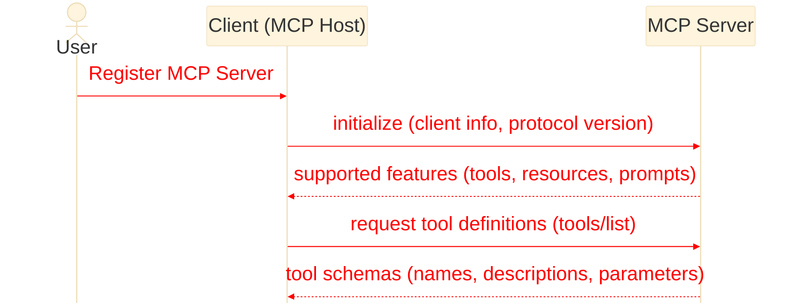

```mermaid
---
config:
  theme: "base"
  fontSize: 32px
  mirrorActors: false
  themeVariables:
    textColor: "red"
---
sequenceDiagram
    actor U as User
    participant C as Client (MCP Host)
    participant M as MCP Server

    U->>C: Register MCP Server
    C->>M: initialize (client info, protocol version)
    M-->>C: supported features (tools, resources, prompts)
    C->>M: request tool definitions (tools/list)
    M-->>C: tool schemas (names, descriptions, parameters)
```
